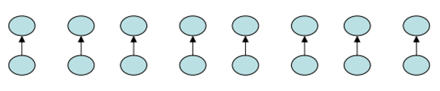

# Lecture 18: Union-Find Data Structure

>Note: The most of the information of these lectures was extracted and adapted from Dr Bajuelos and from Weiss’s book, “Data Structures and Algorithm Analysis in Java". They are provided for COP3530 students only. Not to be published or publicly distributed without permission by the publisher. 

In computer science, a disjoint-set data structure, also called a union–find data structure or merge–find set, is a data structure that stores a collection of disjoint (non-overlapping) sets. Equivalently, it stores a partition of a set into disjoint subsets. It provides operations for adding new sets, merging sets (replacing them by their union), and finding a representative member of a set. The last operation makes it possible to find out efficiently if any two elements are in the same or different sets.

## Disjoint Set Definition

Suppose we have a collection of n distinct items/elements - set. 

We want to make the partition of the set into a collection of sets such that:
* Each item is in a set
* No item is in more than one set

The resulting sets are said to be disjoint sets

Examples:
* {1, 2, 3} and {4, 5, 6} are disjoint sets.
* {x, y, z} and {t, u, x} are not disjoint sets.
* a set of students with “students with GPA≥2.0” and another “students with GPA<2.0”
* Graph vertices according to connected components

## Disjoint Set Terms

We can identify a set by selecting a <b>representative element</b> of the set.

* It doesn’t matter which element we choose, but once chosen, it can’t change.

make-set(x) - create a new set with only x. Assume x is not already in some other set.

find(x) - return the representative of the set containing x.

union(x,y) - combine the two sets containing x and y into one new set. A new representative is selected.

### Example:

Let S = {1,2,3,4,5,6,7,8,9}

Let initial partition be (make-set(x), for each x in S): (representative elements will be underlined)

{1}, {2}, {3}, {4}, {5}, {6}, {7}, {8}, {9}

union(2,5):

{1}, {<u>2</u>, 5}, {3}, {4}, {6}, {7}, {8}, {9}

find(4) = 4, find(2) = 2, find(5) = 2

union(6, 4), union(2,7)

{1}, {<u>2</u>, 5, 7}, {3}, {4, <u>6</u>}, {8}, {9}

find(4) = 6, find(2) = 2, find(5) = 2

union(2,6)

Disjointed set:

{1}, {<u>2</u>, 4, 5, 6, 7}, {3}, {8}, {9}

## Example #2

Find the connected components of the undirected graph G=(V,E) (maximal subgraphs that are connected).


```text
CONNECTED-COMPONENTS
for (each vertex v in V)
	make-set(v)
for (each edge (u,v) in E)
	if (find(u) != find(v))
		union(u,v)
```
By using the find operation we can verify if two vertices, u and v, are in the same connected component by testing:	

```text
SAME-COMPONENT(u,v)
if find(u) = find(v)
   return TRUE
else
   return FALSE
```

## Generation of Mazes: 


What’s a good maze?
* Connected
* Just one path between any two rooms
* Random


Simple Algorithm: 
* Start with walls everywhere (except for the entrance and exit). 
* We then repeatedly choose a wall randomly, and knock it down if the cells that the wall separates are not already connected to each other. 
* If we repeat this process until the starting and ending cells are connected, then we have a maze.


### Initial Configuration for the 5 x 5 table	


We use the union-find data structure to represent sets of cells that are connected to each other. 

* make-set(x), for each x in 0 ... 24 

* {1} {2} {3} {4} {5} {6} {7} {8} {9} {10} {11} {12} {13} {14} {15} {16} {17} {18} {19} {20} {21} {22} {23} {24}

Initially, walls are everywhere, and each cell is in its own representative element.

Later stage of the algorithm after a few walls have been knocked down:


Suppose that the wall that connects cells 8 and 13 is randomly generated. Because 8 and 13 are already connected (they are in the same set), we would not remove the wall. 

Suppose now that cells 18 and 13 are randomly generated. By performing two find operations, we see that find(18)!=find(13) then 18 and 13 are in different sets; thus they are not already connected. Therefore, we knock down the wall that separates them.


Then… 18 and 13 are now connected


At the end of the algorithm, everything is connected, and we are done.


## The algorithm

```text
P = disjoint sets of connected cells (initially each cell is in its own 1-element set)
E = set of edges not yet processed (initially all internal edges)
M = set of edges kept in maze (initially empty)

while P has more than one set
{
	Pick a random edge (x,y) from E
	E = E \ (x,y)
	u = find(x)
	v = find(y)
	if u==v
		M = M joins (x,y)
	else 
		union(u,v)
}
add remaining members of E to M, then output M as the maze
```


## Disjoint set implementation.  Basic ideas

Up-tree implementation
* Basic idea is to use a tree to represent each set.
* Every item/element is in a tree 
* The root of the tree is the representative element of all items in that tree i.e., the root can be use to name the set.
* In this up-tree implementation, every node (except the root) has a pointer pointing to its parent.
* The root element has a pointer pointing to “empty” parent (or pointing to itself).


### find(x) implementation

* Start at x and follow parent pointers to root
* Return the root

Pseudocode:
```text
find(x)
	while (x != “empty” parent)
	     x = x -> parent;
	return x;
```

find(7) = 4


### union(x,y) implementation
Assume x and y are roots
* (else find the roots of their trees)

Assume distinct trees (else do nothing)

Change root of one to have parent be the root of the other

Example:

Before…


After union(4,6)


If elements are contiguous numbers (e.g., 0,1, 2,…, n-1), use an array of length n called up
* Put in array index of parent, with -1 (or 0) for a root

Example:


If set elements are not contiguous numbers, could have a separate dictionary to map elements (keys) to numbers (values)			

```java
public class DisjSets 
{
	public DisjSets (int numElements) 
	public void union (int root1, int root2) 
	public int find (int x) 
}

public int find( int x) 
{ 
	// s[x] is height of tree rooted at x
	if (s[x] < 0) return x;
	else return find(s[x]);
}

public void union(int root1, int root2) 
{
	s[root2] = root1;
}
```

## Optimization of the union operation 

### Union by weight:

Strategy: Always point the smaller tree (by total number of nodes) to the root of the larger tree


```java
public void union (int root1, int root2) 
{
	if (s[root2] < s[root1]) 
		s[root1] = root2;
	else 
	{
		if (s[root1] == s[root2]) 
			s[root1]--;
		s[root2] = root1;
	}
} 
```

### Array Implementation
Keep the weight (number of nodes in a second array)


Instead of storing 0 for a root, store negation of weight
So up value < 0 means a root


Using union by weight…


Then:
* union is still O(1)
* What is worst-case complexity of find(x)?

Theorem: Union by weight guarantees that all up-tress will have height al most O(log n) then find is O(log n). 

## Optimization of the union operation 
Example of the worst case:

n/2 unions by weight



n/4 unions by weight


After n – 1 = n/2 + n/4 + . . . + 1 unions by weight


### Path Compression
Every time a find operation is performed on node x, all
vertices along the path form x to its root are connected
directly to the root, thus compressing the paths that have
been recently visited.

Time Complexity = O(M log*n) 

## Class Problem

Use Union-Find Algorithm can be used to check whether an undirected graph contains cycle or not.


Idea: 

Use an array to keep track of the subsets and which nodes belong to that subset. Let the array be parent[].

Initially, all slots of parent array are initialized to hold the same values as the node.

parent[] = {0, 1, 2}. Also when the value of the node and its parent are same, that is the root of that subset of nodes.

Now process all edges one by one.

Edge 0-1: 
* Find the subsets in which vertices 0 and 1 are. 
* 0 and 1 belongs to subset 0 and 1.
* Since they are in different subsets, take the union of them. 
* For taking the union, either make node 0 as parent of node 1 or vice-versa. 
* 1 is made parent of 0 (1 is now representative of subset {0, 1})
* parent[] = {1, 1, 2}

Edge 1-2: 
* 1 is in subset 1 and 2 is in subset 2.
* Since they are in different subsets, take union.
* Make 2 as parent of 1. (2 is now representative of subset {0, 1, 2})
* parent[] = {1, 2, 2}

Edge 0-2: 
* 0 is in subset 2 and 2 is also in subset 2. 
* Because 1 is parent of 0 and 2 is parent of 1. So 0 also belongs to subset 2
* Hence, including this edge forms a cycle. 

Therefore, the above graph contains a cycle.

### Pseudocode

Initially create a parent[] array to keep track of the subsets.

Traverse through all the edges:
* Check to which subset each of the nodes belong to by finding the parent[] array till the node and the parent are the same.
* If the two nodes belong to the same subset then they belong to a cycle.
* Otherwise, perform union operation on those two subsets.

If no cycle is found, return false.

### Code

```java
// Java Program for union-find algorithm to detect cycle in
// a graph
import java.io.*;
import java.lang.*;
import java.util.*;

public class Graph {
	int V, E; // V-> no. of vertices & E->no.of edges
	Edge edge[]; // /collection of all edges

	class Edge {
		int src, dest;
	};

	// Creates a graph with V vertices and E edges
	Graph(int v, int e)
	{
		V = v;
		E = e;
		edge = new Edge[E];
		for (int i = 0; i < e; ++i)
			edge[i] = new Edge();
	}

	// A utility function to find the subset of an element i
	int find(int parent[], int i)
	{
		if (parent[i] == i)
			return i;
		return find(parent, parent[i]);
	}

	// A utility function to do union of two subsets
	void Union(int parent[], int x, int y)
	{
		parent[x] = y;
	}

	// The main function to check whether a given graph
	// contains cycle or not
	int isCycle(Graph graph)
	{
		// Allocate memory for creating V subsets
		int parent[] = new int[graph.V];

		// Initialize all subsets as single element sets
		for (int i = 0; i < graph.V; ++i)
			parent[i] = i;

		// Iterate through all edges of graph, find subset
		// of both vertices of every edge, if both subsets
		// are same, then there is cycle in graph.
		for (int i = 0; i < graph.E; ++i) {
			

			//TODO
		}
		return 0;
	}

	// Driver Method
	public static void main(String[] args)
	{
		/* Let us create the following graph
		0
		| \
		| \
		1---2 */
		int V = 3, E = 3;
		Graph graph = new Graph(V, E);

		// add edge 0-1
		graph.edge[0].src = 0;
		graph.edge[0].dest = 1;

		// add edge 1-2
		graph.edge[1].src = 1;
		graph.edge[1].dest = 2;

		// add edge 0-2
		graph.edge[2].src = 0;
		graph.edge[2].dest = 2;

		if (graph.isCycle(graph) == 1)
			System.out.println("Graph contains cycle");
		else
			System.out.println(
				"Graph doesn't contain cycle");
	}
}

```
